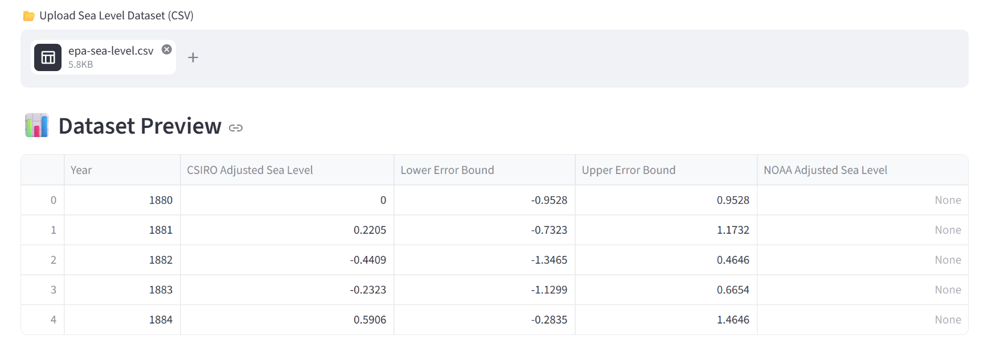
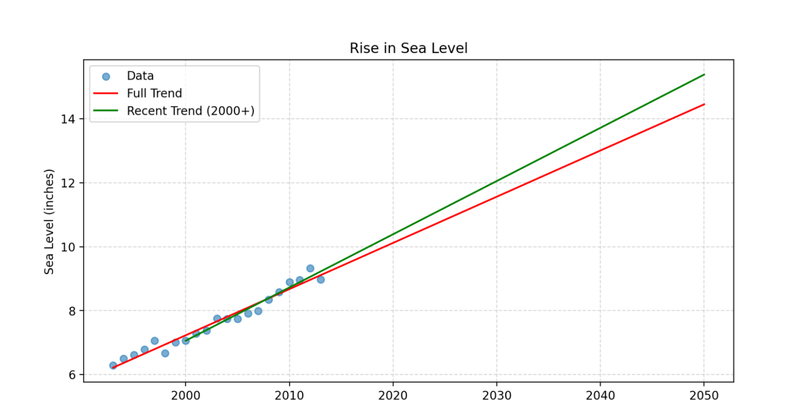
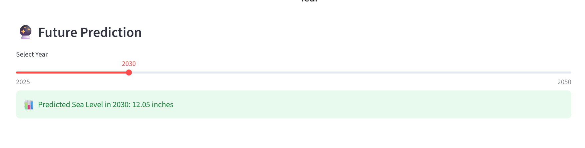

🌊 Sea Level Predictor
---
A data visualization and prediction app that analyzes historical sea level data and forecasts future sea levels using linear regression.

***

🚀 Live Demo
---
👉(https://sea-level-predictor-bxha3gfvjlbswtbgqyztzp.streamlit.app/)

***

📌 Features
---
* 📂 Upload your own sea level dataset (CSV)
* 📊 Interactive dataset preview
* 📈 Scatter plot of historical sea levels
* 🔴 Linear regression (full dataset trend)
* 🟢 Linear regression (recent trend from 2000)
* 🔮 Future sea level prediction (slider-based)
* 🎯 Clean and interactive Streamlit UI

***

## 🖼️ Screenshots

---

### 📊 Dataset Preview

---

### 📈 Trend Visualization

---

### 🔮 Future Prediction

***

🛠️ Tech Stack
---
* Python
* Streamlit
* Pandas
* Matplotlib
* SciPy (Linear Regression)

***

⚙️ Installation & Setup
---
# Clone the repository
git clone https://github.com/AlamgirKhan48692/sea-level-predictor.git

# Navigate to project folder
cd sea-level-predictor

# Install dependencies
pip install -r requirements.txt

# Run the app
streamlit run app.py

***

📊 How It Works
---
* Upload a CSV dataset (e.g., epa-sea-level.csv)
* The app:
* Cleans the data
* Plots historical sea levels
* Applies linear regression
* Predicts future sea levels using:
* Full dataset trend
* Recent trend (after 2000)

***

📈 Example Insights
---

* Sea level shows a consistent upward trend
* Recent years indicate faster acceleration
* Future projections suggest continued rise

***

⚠️ Disclaimer
---
* This project is for educational and visualization purposes only
* Predictions are based on simple linear regression
* Not intended for scientific or policy decisions

***

👨‍💻 Author
---
Alamgir Khan

🌐 GitHub:
---
https://github.com/AlamgirKhan48692
